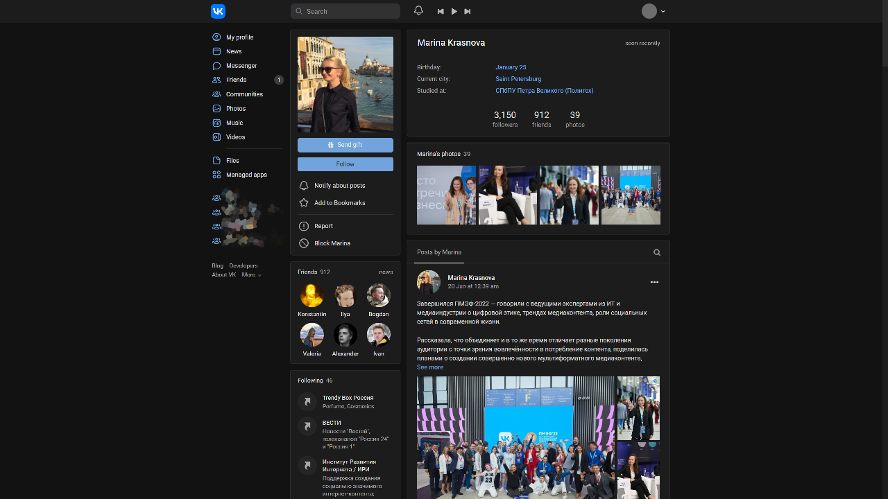

## Official dark mode
Is now available, so you can use it instead. If you don't like it, you can use [the new light userstyle](https://github.com/a0eoc/UserCSS/tree/main/VK/Vdarker) I made because this 11k line CSS has became too hard to maintain.

Optional features such as ads hiding are separated to [CleanVK](https://github.com/a0eoc/UserCSS/tree/main/VK/Enhancements).

##

<h1 align="center">
    
</h1>

## Install
**Stylus:**
1. For the theme to work, you need to install the [Stylus](https://chrome.google.com/webstore/detail/stylus/clngdbkpkpeebahjckkjfobafhncgmne) extension.
2. Install [Theme](https://github.com/a0eoc/VDARK/raw/master/vdark.user.css).

## Preview (Version 2.12.0)

## Credits
- [Wondermarin](https://github.com/Wondermarin) for creating most of the style
- [VDARK contributors](https://github.com/Wondermarin/VDARK/graphs/contributors)
- [yhdgms1](https://github.com/yhdgms1)

I had to wipe the git history to hide some sensetive info.

## License
Code released under the [CC-BY-NC-4.0](https://spdx.org/licenses/CC-BY-NC-4.0.html#licenseText) license.
